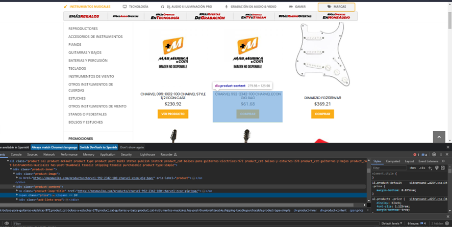
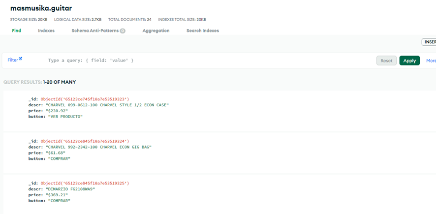

# prueba1
Para la parte 1 se tomó una página que vende instrumentos musicales para el caso de estudio
para ello se tomó los datos de algunas

Como primer paso se inspeccionó las clases que tiene la página para tomar los datos

Se procedió a programar en el archivo main.py la obtención de los datos de la clase
Y para el almacenamiento de datos en mongo DB se procedió a programar en el archivo MONGO.py como se muestra en la imagen

